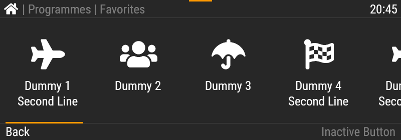
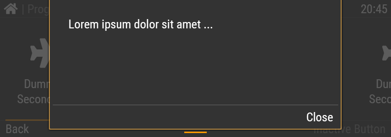

# Task "React.js Prototyping"

## Scenario

The design team has created a couple of screens for a new embedded device with a color touch display. The screens only show a static view and the design team would like to see them animated and usable as a prototype to get feedback from stakeholders. They would like to view and test the final prototype in a [Storybook](https://storybook.js.org/) as this has worked well in the past.

> Most of the time, we have to work with simple screens and vague requirements. The design team wants to see the screens interactive.

## Briefing from Design Center

### Screen 1 "Program List"

- This is a list of programs, each with icon and name.
  - The first 5 are visible. To see the rest, the list needs to be scrolled.
  - Clicking on a list item will change the color to orange. It should later change to a different screen.
- The list can be scrolled like a list on a smartphone (click + drag).
  - If you drag past the start or end, it should feel like there are rubberbands attached. Just like on a smartphone.
  - The scrolling should "snap" to the program icons so that it does not stop half-way with the first visible icon cut-off.
- The orange line below the list is a scroll indicator.
  - At the end of the list, it will be positioned all the way on the right side.
- The "Back" is a button. It will change to orange when clicked.
- The inactive button cannot be clicked.
- The text font is "Roboto Condensed Regular".
- The icons use "Font Awesome Solid" and have these unicode positions:

| Icon     | Char Code |
| -------- | --------- |
| Home     | `0xF015`  |
| Airplane | `0xF072`  |
| People   | `0xF0C0`  |
| Umbrella | `0xF0E9`  |
| Flag     | `0xF11E`  |

> We actually use a custom Miele font for text and another one for icons. Both cannot be provided to you for this task. "Roboto Condensed" and "Font Awesome" are freely available and work the same way as our custom fonts. The icons are also just placeholders for program icons.

### Screen 2 "Pulldown"

- The orange line at the top (middle) of Screen 1 is a handle for a pull-down.
  - Clicking the handle will scroll the Pulldown into view.
  - The handle can also be dragged to reveal the Pulldown.
  - When dragged and released, it animates back into position closed (less than half-way) or open (more than half-way).
- The Pulldown is an overlay over the current screen.
  - The overlay fades in with the movement of the pulldown.
  - The screen content below is dimmed (less visible).
- Clicking "Close" (or the handle) moves the Pulldown up.
- Clicking outside the pulldown does not do anything.
  - The content below the overlay cannot be clicked or scrolled.

## Your Task

1. **Implement the screens** in React.js with multiple components and make them available in storybook.
   - Use this project as a boilerplate.
   - The underlying components (the program carousel & the pulldown) should be implemented from scratch using one of the animation/interaction methods listed below. Third party libraries are great when you need something basic, but our UI components are usually complex and the desired behavior cannot be implemented with them.
   - Use as many stories as you like – depending on your component implementation.
   - As a plus, use [Controls](https://storybook.js.org/docs/essentials/controls) so that the design team can "play" with the components. This only works well for simple cases with string, number, bool, or state/selections.
   - The prototype only needs to work in a recent version of "Google Chrome".
2. **Use git** for source control.
   - Work with multiple commits throughout the process.
   - Remove any file that is not necessary for the task (i.e. from the boilerplate).
3. Use any **additional NPM packages** for your work to get the task done. Consider using only MIT licensed packages.
4. For **animations/interaction**, you may use whatever fits to get the task done appropriately, i.e.
   - CSS Transitions
   - [react-spring](https://www.react-spring.dev/)
   - [Framer Motion](https://motion.dev/)
   - or any other MIT licensed framework.
5. Write a simple **smoke test** for each component, i.e. "renders without crashing". Vitest is already setup and running.
6. **Publish your work** on github.com (or similar platform) for us to take a look at.
   - As an alternative, ZIP your code _including_ the (hidden) `.git` folder.
   - Please include a (static) built of your storybook in the repository. Usually, it would not be included in the repository, but it makes it easier to look at the task without having to build it or use a build server.

## Hints for the Task

- When scrolling is required, "CSS overflow" is not the best choice as it cannot be controlled well enough.
- If you have to make assumptions, try to add a short comment.
